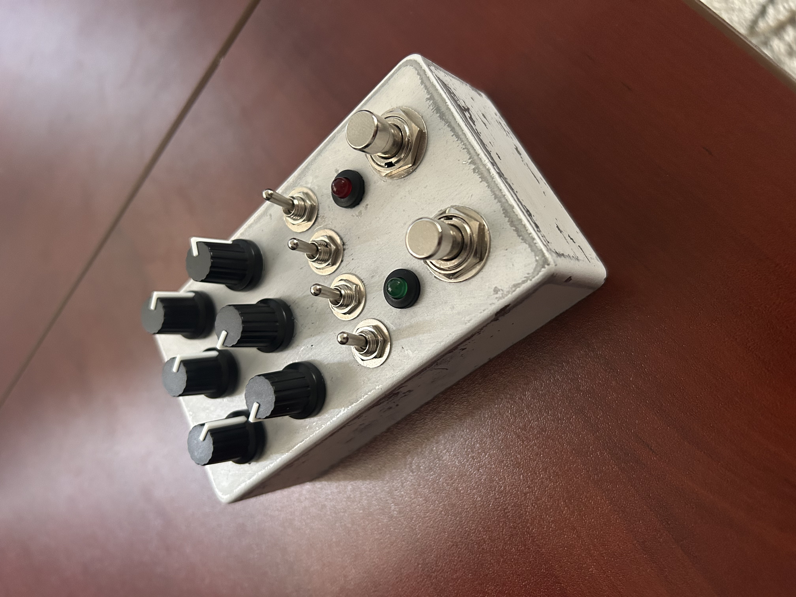

# Chimera

A DIY multi-effect guitar pedal built with Daisy Seed.

Check out the following posts for an explanation of the hardware and software:
- https://dbusteed.github.io/chimera-guitar-pedal-part-1/
- https://dbusteed.github.io/chimera-guitar-pedal-part-2/
  
